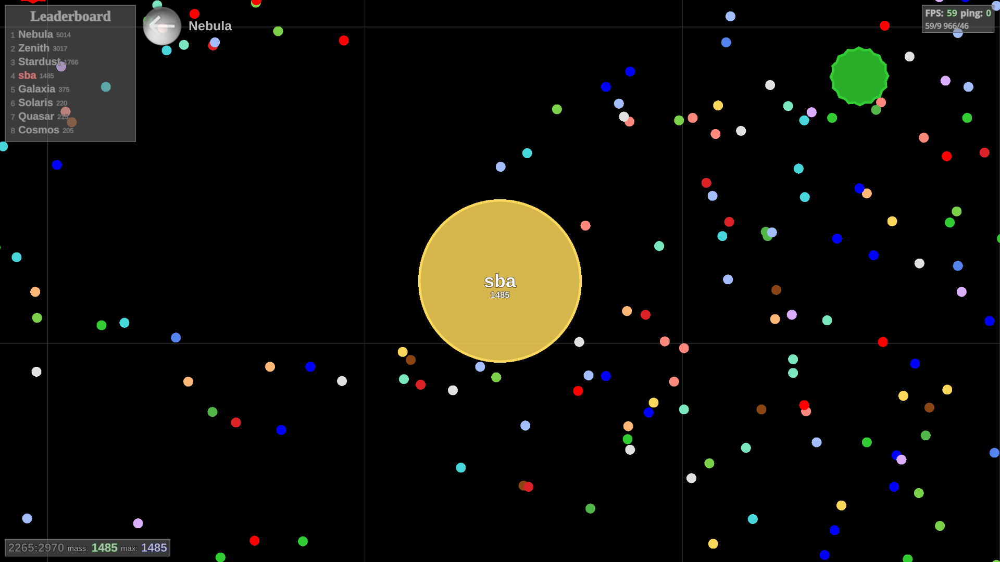

# The Game Client


This project is the browser client for the multiplayer game "The Game". It allows players to interact with the game 
using modern web development technologies and frameworks such as Vue.js, Vuetify, and PIXI.js. Players can enjoy
exciting gameplay and interact with each other in the virtual world, similar to agar.io.



## Installation

```bash
npm install
```

## Usage

### Development
`npm run dev`

### Building for Production
`npm run build`

### Previewing Production Build
`npm run preview`

### Running Tests
`npm test`

## Technologies Used
- Vue.js
- Vuetify
- PIXI.js

## Contributing
Contributions are welcome! Feel free to open an issue or submit a pull request.

## License
This project is licensed under the MIT License - see the [LICENSE](https://github.com/realsba/the-game-client/blob/main/LICENSE) file for details.

## Author
- Bohdan Sadovyak

## Bugs/Issues
Please report any bugs or issues [here](https://github.com/realsba/the-game-client/issues).

